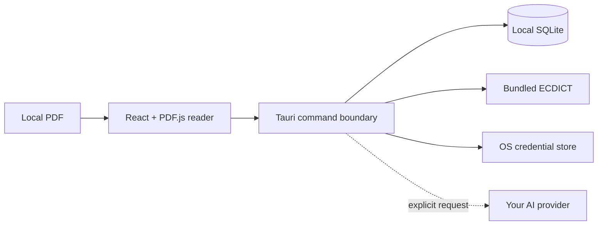

<p align="center">
  
</p>

<h1 align="center">PaperLens</h1>

<p align="center">
  <strong>Read a paper once. Keep its vocabulary forever.</strong><br />
  A local-first desktop paper reader that turns unfamiliar terminology into a searchable, contextual vocabulary library.
</p>

<p align="center">
  <a href="README.zh-CN.md"><strong>简体中文</strong></a>
  ·
  <strong>English</strong>
</p>

<p align="center">
  <a href="https://github.com/Yan-Haiyang-Tju/PaperLens/releases/latest"></a>
  <a href="https://github.com/Yan-Haiyang-Tju/PaperLens/releases/latest"></a>
  <a href="https://github.com/Yan-Haiyang-Tju/PaperLens/releases/latest"></a>
</p>

<p align="center">
  <a href="https://github.com/Yan-Haiyang-Tju/PaperLens/actions/workflows/ci.yml"></a>
  <a href="https://github.com/Yan-Haiyang-Tju/PaperLens/releases/latest"></a>
  <a href="https://github.com/Yan-Haiyang-Tju/PaperLens/releases"></a>
  <a href="LICENSE"></a>
</p>


> A PDF reader helps you finish a paper. **PaperLens helps you remember the language of the field.**

## Your papers are full of terminology worth keeping

Copying a definition into a separate notebook loses the sentence that made it useful. Browser searches break concentration. Flat word lists forget where a term came from.

PaperLens turns vocabulary capture into part of reading:

1. **Select a term** in the PDF.
2. **Get an offline English–Chinese definition** immediately—no setup or account.
3. **Save it once** with the paper, page, selected text, and surrounding sentence attached.
4. **Review it later** across one paper or your entire library, then move it from *New* to *Mastered*.

<table>
  <tr>
    <td width="50%" valign="top">
      
      <br /><sub><strong>Look it up without leaving the page.</strong> The bundled 400K+ entry ECDICT dictionary works offline from the first launch.</sub>
    </td>
    <td width="50%" valign="top">
      
      <br /><sub><strong>Keep the reason the word mattered.</strong> Every saved term remains connected to its original sentence and page.</sub>
    </td>
  </tr>
</table>

## A vocabulary library built from your actual research

Not a generic flashcard deck. Not a pile of copied definitions. PaperLens builds a terminology index from the papers you are reading—`convolutional`, `transduction`, `recurrent`, and `parallelizable` below all came directly from the abstract of the same paper.


- Search terminology across the whole library or stay inside the current paper.
- Preserve separate occurrences when the same term appears in different papers.
- Jump from an occurrence back to its source page.
- Track familiarity as **New**, **Learning**, **Familiar**, or **Mastered**.
- Import a licensed specialist dictionary when your field needs more than the built-in lexicon.

## One reading loop, without the tab switching

| | PaperLens advantage |
| --- | --- |
| **Serious PDF reading** | Selectable text, thumbnails, incremental outline, full-document search, rotation, fit modes, and smooth `Ctrl/⌘ + mouse wheel` zoom. Reading position and zoom are restored automatically. |
| **Contextual vocabulary** | Offline definitions, one-click capture, original sentences, page references, global search, and familiarity tracking in one workflow. |
| **Notes with provenance** | Markdown notes stay attached to the selected passage and page. General paper notes are also available when no selection is needed. |
| **AI on your terms** | Optional AI explanations receive the selected passage and its local context only after you explicitly request them. Use your own compatible provider and API key. |
| **A library that scales** | Nested folders, multi-folder membership, drag and drop, Recent and Unfiled views—without copying the original PDF. |
| **Local-first by design** | PDFs, reading state, folders, vocabulary, highlights, notes, and cached results stay on your device. No analytics or advertising SDKs. |

<table>
  <tr>
    <td width="50%" valign="top">
      
      <br /><sub><strong>Write beside the evidence.</strong> Notes retain the selected phrase and source page.</sub>
    </td>
    <td width="50%" valign="top">
      
      <br /><sub><strong>Organize without duplicating files.</strong> The same local paper can belong to multiple nested collections.</sub>
    </td>
  </tr>
</table>

<p align="center"><sub>Product screenshots use <a href="https://arxiv.org/abs/1706.03762"><em>Attention Is All You Need</em></a> by Vaswani et al. (2017), arXiv:1706.03762. The paper and its authors are not affiliated with or endorsing PaperLens.</sub></p>

## Download and start reading

Open the [latest release](https://github.com/Yan-Haiyang-Tju/PaperLens/releases/latest), choose your platform, and open a local PDF. The dictionary works immediately; AI configuration is optional.

| Platform | Download | Notes |
| --- | --- | --- |
| **Windows 10/11 x64** | `.msi` or `-setup.exe` | Run the installer, then open PaperLens from the Start menu. |
| **macOS Apple Silicon** | `aarch64.dmg` | Open the image and drag PaperLens into Applications. |
| **Linux x86_64** | `.AppImage`, `.deb`, or `.rpm` | Run the AppImage or install the package for your distribution. |

Current community packages are not code-signed or notarized. Windows SmartScreen or macOS Gatekeeper may show an unknown-developer warning. Download only from this repository's Releases page and review the release details before allowing an unsigned build to run.

Want to try the exact flow shown above? Download [Attention Is All You Need from arXiv](https://arxiv.org/pdf/1706.03762), open it in PaperLens, and select `convolutional` in the abstract.

## Privacy is a product feature

- PaperLens reads PDFs from their existing local paths; it does not silently copy or upload them.
- Selecting text never starts an AI request or remote dictionary lookup by itself.
- The built-in dictionary is offline. Remote dictionary access is disabled until you configure it.
- The exact outbound context is shown before the first AI request; local file paths are removed.
- API keys are stored by Windows Credential Manager, macOS Keychain, or Linux Secret Service.
- `.paperlens` backups contain application data, but never API keys or PDF files.

See [SECURITY.md](SECURITY.md) for the security model and private vulnerability reporting.

## Shortcuts that stay out of the way

| Action | Shortcut | Action | Shortcut |
| --- | --- | --- | --- |
| Open PDF | `Mod+O` | Search in paper | `Mod+F` |
| Dictionary | `Alt+D` | Save vocabulary | `Alt+S` |
| Highlight | `Alt+H` | New note | `Alt+N` |
| AI explanation | `Alt+A` | Toggle sidebar | `Mod+Shift+B` |
| Zoom | `Mod` + `+` / `-` / `0` | Close panel or popover | `Esc` |

`Mod` means Ctrl on Windows/Linux and Command on macOS. Shortcuts are configurable and conflicts are reported.

## Frequently asked questions

<details>
<summary><strong>Do I need to import a dictionary?</strong></summary>

No. PaperLens ships with a 400K+ entry ECDICT-based English–Chinese dictionary. Importing a specialist dictionary or configuring a remote provider is optional.
</details>

<details>
<summary><strong>Is AI required?</strong></summary>

No. PDF reading, search, folders, highlights, notes, vocabulary capture, and offline definitions work without AI. AI is an optional bring-your-own-key enhancement.
</details>

<details>
<summary><strong>Does PaperLens upload my papers?</strong></summary>

No. PDFs stay at their original local paths. Only the context displayed in the privacy preview is sent when you explicitly request an AI explanation.
</details>

<details>
<summary><strong>Can it read scanned PDFs?</strong></summary>

Scanned pages can be displayed, but text selection and search require OCR, which is not bundled yet. Text-layer PDFs provide the full experience.
</details>

## Build from source

<details>
<summary><strong>Development setup, architecture, and verification</strong></summary>

Requirements: Node.js 22+, npm 10+, stable Rust, and the [Tauri 2 platform prerequisites](https://v2.tauri.app/start/prerequisites/).

```bash
git clone https://github.com/Yan-Haiyang-Tju/PaperLens.git
cd PaperLens
npm ci
npm run tauri build
```

Useful development commands:

```bash
npm run dev
npm run tauri dev
npm run typecheck
npm run lint
npm test
npm run test:e2e
```

Python and Conda are not application dependencies. Python is only used by maintainers when regenerating the committed ECDICT resource.



The renderer owns reading interactions. Rust owns privileged file access, bundled dictionary lookup, provider networking, credentials, import/export validation, cancellation, and structured AI response repair. A strict capability policy and CSP keep that boundary narrow.

</details>

## Contributing

Focused bug reports, feature proposals, documentation improvements, and pull requests are welcome. Read [CONTRIBUTING.md](CONTRIBUTING.md) first. Report security issues privately through [SECURITY.md](SECURITY.md).

## Acknowledgements

- [ECDICT](https://github.com/skywind3000/ECDICT), used for the bundled offline dictionary under the MIT License.
- [PDF.js](https://github.com/mozilla/pdf.js), [Tauri](https://tauri.app/), React, and the wider open-source ecosystem.

## License

PaperLens is released under the [MIT License](LICENSE). © 2026 PaperLens contributors.
