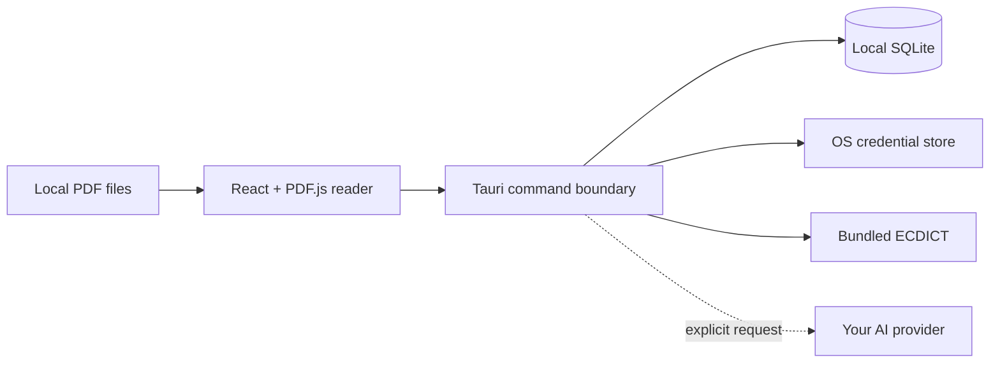

<div align="center">
  

  <h1>PaperLens</h1>

  <p><strong>Read papers deeply. Keep your research yours.</strong></p>
  <p>A fast, local-first desktop PDF reader with an offline dictionary, connected notes, organized libraries, and context-aware AI.</p>

  <p>
    <a href="README.zh-CN.md">简体中文</a>
    ·
    <strong>English</strong>
  </p>

  <p>
    <a href="https://github.com/Yan-Haiyang-Tju/PaperLens/releases/latest"></a>
    <a href="https://github.com/Yan-Haiyang-Tju/PaperLens/releases/latest"></a>
    <a href="https://github.com/Yan-Haiyang-Tju/PaperLens/releases/latest"></a>
  </p>

  <p><sub>Latest release: v0.2.0 · Free and open source · Your AI provider, your API key</sub></p>

  [](https://github.com/Yan-Haiyang-Tju/PaperLens/actions/workflows/ci.yml)
  [](https://github.com/Yan-Haiyang-Tju/PaperLens/releases/latest)
  [](https://github.com/Yan-Haiyang-Tju/PaperLens/releases)
  [](LICENSE)
</div>


PaperLens brings the work around a paper into one focused desktop workspace. Open a local PDF, move through its outline, look up unfamiliar terms, highlight evidence, write notes, and ask for an explanation without losing your place—or handing your library to a hosted reading service.

## Start reading in three steps

1. **Download PaperLens** from the buttons above and install the package for your system.
2. **Open a PDF** or drop it into the window. Create folders to organize papers by project, topic, or reading list.
3. **Select any text** to look it up, highlight it, attach a note, save vocabulary, or ask AI for a contextual explanation.

The built-in English–Chinese dictionary works offline on first launch. AI is optional and uses an API key from your own provider.

## One workspace for the whole reading loop

| | What PaperLens gives you |
| --- | --- |
| **A fluid PDF reader** | Selectable text, thumbnails, fast outline navigation, full-document search, fit modes, rotation, keyboard zoom, and `Ctrl/⌘ + mouse wheel` zoom. Your page and zoom level are restored automatically. |
| **Instant offline definitions** | A bundled ECDICT-based English–Chinese dictionary works without setup or a network connection. Imported dictionaries and an optional remote provider can extend it. |
| **Notes that keep their source** | Highlights, Markdown notes, vocabulary, and AI answers stay connected to the selected passage and page instead of becoming an unrelated document. |
| **Context-aware AI** | Send the selected text together with its surrounding sentence, paragraph, page, and section. Stream the answer, cancel it, retry it, or save it as a note. |
| **A library you can shape** | Create nested folders, place a paper in more than one collection, and use All Papers, Recent, or Unfiled views—without duplicating the PDF. |
| **Local-first by default** | Papers and reading data remain on your device. Network access happens only when you explicitly invoke a configured AI or remote dictionary provider. |

PaperLens includes Graphite, Paper Light, Sepia, Midnight, and system-aware themes, with a compact interface designed for long reading sessions.

## Download and install

Open the [latest release](https://github.com/Yan-Haiyang-Tju/PaperLens/releases/latest) and choose the file for your platform:

| Platform | Choose | Install |
| --- | --- | --- |
| **Windows 10/11** | `.msi` or `-setup.exe` | Run the installer, then launch PaperLens from the Start menu. |
| **macOS** | `.dmg` | Open the image and drag PaperLens into Applications. Choose the package matching Apple Silicon or Intel when both are available. |
| **Linux** | `.AppImage` or `.deb` | Make the AppImage executable and run it, or install the Debian package with your package manager. |

Release builds are currently unsigned. Windows SmartScreen or macOS Gatekeeper may therefore identify PaperLens as an unknown developer. Verify that the file came from this repository's Releases page, then use the operating system's **More info → Run anyway** or **Privacy & Security → Open Anyway** control if you trust the download.

## Everyday workflow

### Read and navigate

- Open files from the library, the file picker, or drag and drop.
- Browse page thumbnails or the document outline, and search across the full paper.
- Zoom from the toolbar, keyboard, or `Ctrl/⌘ + mouse wheel`; fit the page or width when you want a distraction-free column.
- Return later at the same page, zoom, and reading position.

### Look up a term instantly

Select a word and choose **Dictionary**. PaperLens checks its memory and local cache, your imported entries, the bundled offline dictionary, and then an optional remote source. No dictionary download or account is required.

The bundled data is derived from [ECDICT](https://github.com/skywind3000/ECDICT) and distributed under the MIT License. Its attribution is included with every application bundle. You can still import a licensed JSON dictionary from Settings if you need specialist terminology.

### Highlight and take notes

Select a passage, then choose a highlight color or create a Markdown note. Open **Notes** from the sidebar to browse paper notes; selecting a note returns you to its source. A paper can also have general notes that are not tied to a selection.

### Ask AI—only when it helps

Open **Settings → AI explanation**, choose OpenAI or an OpenAI-compatible provider, enter a supported model, and save your own API key. Then select text and choose **AI explanation**.

Before the first request, PaperLens shows the exact context that will leave the device. Requests are sent by the native Rust layer; API keys live in Windows Credential Manager, macOS Keychain, or Linux Secret Service and are never exported with your library.

### Organize a growing library

Use folders for projects, fields, courses, or review stages. Folders can be nested, and the same paper can belong to several folders without copying the original file. Deleting a folder never deletes the PDF.


## Useful shortcuts

| Action | Shortcut | Action | Shortcut |
| --- | --- | --- | --- |
| Open PDF | `Mod+O` | Search in paper | `Mod+F` |
| Dictionary | `Alt+D` | AI explanation | `Alt+A` |
| Highlight | `Alt+H` | New note | `Alt+N` |
| Save vocabulary | `Alt+S` | Toggle sidebar | `Mod+Shift+B` |
| Zoom | `Mod` + `+` / `-` / `0` | Close popover or panel | `Esc` |

`Mod` is Ctrl on Windows/Linux and Command on macOS. Shortcuts can be changed in Settings; conflicts are reported before they interrupt your workflow.

## Privacy by design

- PaperLens reads PDFs from their existing local paths; it does not silently upload or duplicate them.
- Reading progress, folders, highlights, notes, vocabulary, and cached explanations are stored locally in SQLite.
- Selecting text alone never starts a dictionary or AI network request.
- The first AI request includes a preview of the exact outbound context; local file paths are removed.
- API keys are stored by the operating system's credential service and cannot be read back by the renderer.
- `.paperlens` backups contain application data, but never API keys or PDF files.
- PaperLens contains no analytics or advertising SDK.

See [SECURITY.md](SECURITY.md) for the security policy and private vulnerability reporting instructions.

## Frequently asked questions

<details>
<summary><strong>Do I need to import a dictionary?</strong></summary>

No. PaperLens includes an offline ECDICT-based English–Chinese dictionary. Importing another dictionary or configuring a remote endpoint is optional.
</details>

<details>
<summary><strong>Do I need AI to use PaperLens?</strong></summary>

No. PDF reading, search, folders, highlights, notes, vocabulary, and offline definitions work without AI. AI is a bring-your-own-key enhancement.
</details>

<details>
<summary><strong>Does PaperLens upload my papers?</strong></summary>

No. PDFs stay at their original paths. Only the context shown in the privacy preview is sent when you explicitly request an AI explanation.
</details>

<details>
<summary><strong>Why does my operating system show a security warning?</strong></summary>

Current community builds are not code-signed or notarized. Download only from this repository's Releases page and verify the release notes before allowing an unsigned build to run.
</details>

<details>
<summary><strong>Can PaperLens read scanned PDFs?</strong></summary>

Scanned pages can be displayed, but selecting and searching their text requires OCR, which is not included yet. Text-layer PDFs provide the complete experience.
</details>

## Build from source

You need Node.js 22+, npm 10+, stable Rust, and the [Tauri 2 platform prerequisites](https://v2.tauri.app/start/prerequisites/) for your operating system.

```bash
git clone https://github.com/Yan-Haiyang-Tju/PaperLens.git
cd PaperLens
npm ci
npm run tauri build
```

For development:

```bash
npm run dev          # React UI in a browser
npm run tauri dev    # Native desktop application
npm run typecheck
npm run lint
npm test
npm run test:e2e
```

Python and Conda are not application dependencies. The ECDICT build script is only for maintainers regenerating the bundled dictionary resource.

## Architecture



The React renderer owns reading interactions and presentation. Rust owns privileged file access, the bundled dictionary, provider networking, credentials, import/export validation, cancellation, and structured AI response repair. Tauri capabilities and a strict content security policy keep that boundary narrow.

## Test and contribute

```bash
npm run typecheck
npm run lint
npm test
npm run build
npm run test:e2e
cargo fmt --manifest-path src-tauri/Cargo.toml --check
cargo clippy --manifest-path src-tauri/Cargo.toml --all-targets -- -D warnings
cargo test --manifest-path src-tauri/Cargo.toml --all-targets
```

Bug reports, focused feature proposals, documentation improvements, and pull requests are welcome. Read [CONTRIBUTING.md](CONTRIBUTING.md) before contributing. For sensitive reports, follow [SECURITY.md](SECURITY.md) instead of opening a public issue.

## Acknowledgements

- [ECDICT](https://github.com/skywind3000/ECDICT), used for the bundled offline dictionary under the MIT License.
- [PDF.js](https://github.com/mozilla/pdf.js), [Tauri](https://tauri.app/), and the wider open-source ecosystem that makes a private, capable desktop reader possible.

## License

PaperLens is released under the [MIT License](LICENSE). © 2026 PaperLens contributors.
