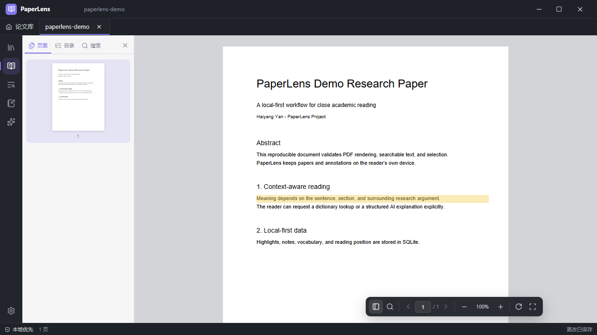
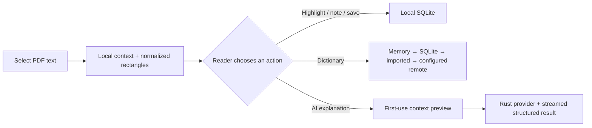
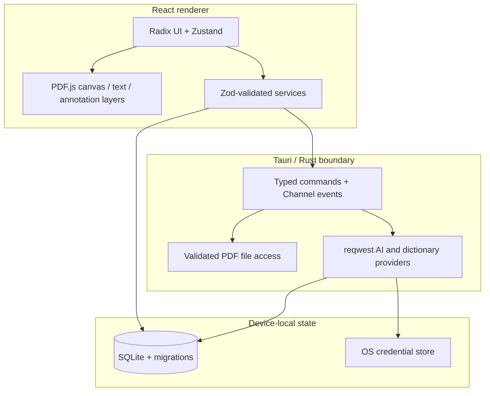

<div align="center">
  
  <h1>PaperLens</h1>
  <p><strong>A calm, local-first academic PDF reader with context-aware explanations.</strong></p>
  <p>Read closely. Keep your papers private. Ask for help only when you want it.</p>

  [](https://github.com/Yan-Haiyang-Tju/PaperLens/actions/workflows/ci.yml)
  [](https://v2.tauri.app/)
  [](https://react.dev/)
  [](LICENSE)

  **English** · [简体中文](README.zh-CN.md)
</div>



PaperLens is a cross-platform desktop reading workspace for research papers. It combines a serious PDF.js reader, local SQLite annotations, a provider-based dictionary, and opt-in structured AI explanations behind a native Tauri/Rust security boundary. The application never performs a dictionary or AI request merely because text was selected.

## Highlights

| Reading | Knowledge workflow | Native and private |
| --- | --- | --- |
| Canvas + selectable text + annotation layers | Context-aware dictionary and structured AI explanations | Tauri 2 commands and strict capability/CSP policy |
| Thumbnails, outline, full-document search, zoom, fit, rotate | Highlights, Markdown notes, vocabulary occurrences | SQLite persistence with foreign keys and migrations |
| Multi-tab library, drag and drop, recent papers, reading-position restore | Exact first-request privacy preview, streaming, cancel, retry, response repair | API keys stay in the OS credential store |
| Near-viewport rendering and capped device pixel ratio | Markdown, GFM, KaTeX, confidence and model details | Data export/import/backup; exports exclude keys and PDFs |

Five built-in visual modes—Graphite, Paper Light, Sepia, Midnight, and System—share a compact, desktop-native interaction system. Reader code is lazy-loaded, so the library and settings start without loading PDF.js.

## Selection is an explicit action boundary

Selecting text only opens a local toolbar. PaperLens extracts the sentence, adjacent sentences, paragraph, page, section, confidence, and normalized page coordinates locally. Nothing leaves the device until the reader clicks a service action.



## Privacy and security model

- PDF files are read from their original local paths. PaperLens does not copy them into the database or upload them automatically.
- OpenAI and OpenAI-compatible requests originate in Rust. The renderer can set or delete a key, but there is no command that returns the complete key.
- Keys use Windows Credential Manager, macOS Keychain, or Linux Secret Service through the Rust `keyring` backend.
- The exact outbound context is shown before the first AI request. Local filesystem paths are stripped and long fields are truncated at word boundaries.
- Saving full AI request context is off by default. Request metadata uses a context hash and sanitized error categories.
- `.paperlens` exports contain a database snapshot and manifest, but no API key and no PDF file.
- Remote dictionary access is disabled until the reader supplies an HTTPS endpoint (localhost HTTP is allowed for development).

## Architecture



The renderer owns presentation and PDF interaction. Rust owns privileged file access, provider networking, secure credentials, import/export validation, cancellation, and AI response repair. Every streamed event carries `paperId`, `selectionId`, and `requestId`; the store rejects stale events from a previous paper or selection.

## Install

Installers for Windows, macOS, and Linux are produced by the release workflow for tagged versions. See [GitHub Releases](https://github.com/Yan-Haiyang-Tju/PaperLens/releases). Unsigned local builds may trigger the operating system's standard warning until project signing identities are configured.

### Build from source

Requirements:

- Node.js 22+ and npm 10+
- Rust stable
- Tauri 2 platform prerequisites: WebView2 on Windows, WebKitGTK 4.1 on Linux, or Xcode command-line tools on macOS

```bash
git clone https://github.com/Yan-Haiyang-Tju/PaperLens.git
cd PaperLens
npm ci
npm run tauri build
```

Development commands:

```bash
npm run dev          # browser-friendly UI development
npm run tauri dev    # native desktop development
npm run typecheck
npm run lint
npm test
npm run test:e2e     # builds production assets, then runs browser smoke tests
```

PaperLens does not require Python or Conda. If you need a custom compiler/toolchain, keep it project-local; `.tools/`, `.conda/`, build outputs, caches, databases, and `.env` files are ignored.

## AI providers

Open **Settings → AI explanation** and choose:

- **OpenAI Responses API** — strict JSON Schema output and native streaming.
- **OpenAI-compatible** — configurable HTTPS base URL with chat-completions-style structured JSON.
- **Mock** — network-free deterministic output in development builds only.

Enter the exact model supported by your provider, save the API key, and run **Test connection**. The AI panel supports streaming status, cancel, repair status, retry, copy, save as note, save as vocabulary, context inspection, token usage, cache status, and confidence.

## Dictionary import

PaperLens intentionally ships without an unlicensed dictionary corpus. Import a UTF-8 JSON array containing records in this shape:

```json
[
  {
    "term": "compliance",
    "phonetic": "/kəmˈplaɪəns/",
    "meanings": [
      { "partOfSpeech": "noun", "definitionsZh": ["合规；遵从"] }
    ],
    "lemma": "compliance",
    "source": "my-licensed-dictionary",
    "cachedAt": null
  }
]
```

Only import data you are licensed to use. Lookups follow a deterministic order: memory cache → SQLite cache → imported entries → configured remote provider.

## Default shortcuts

| Action | Shortcut | Action | Shortcut |
| --- | --- | --- | --- |
| Open PDF | `Mod+O` | Search paper | `Mod+F` |
| Dictionary | `Alt+D` | AI explanation | `Alt+A` |
| Highlight | `Alt+H` | Note | `Alt+N` |
| Save vocabulary | `Alt+S` | Toggle sidebar | `Mod+Shift+B` |
| Zoom | `Mod` + `+` / `-` / `0` | Close transient panel | `Esc` |

`Mod` means Ctrl on Windows/Linux and Command on macOS. Shortcuts are editable; conflicts are identified in Settings and shortcuts do not fire while typing in an input.

## Verification

The repository includes unit, component, integration, database, Rust provider, and browser E2E coverage. The E2E suite generates a valid text-layer PDF at runtime and verifies rendering, page navigation, native text selection, the selection toolbar, and an annotation overlay. A separate real-world 15-page research paper was used during development to validate PDF.js parsing and search text extraction.

```bash
npm run lint
npm test
npm run build
npm run test:e2e
cargo fmt --manifest-path src-tauri/Cargo.toml --check
cargo clippy --manifest-path src-tauri/Cargo.toml --all-targets -- -D warnings
cargo test --manifest-path src-tauri/Cargo.toml --all-targets
```

## Current scope

- Text-layer PDFs are fully supported. Scanned-image PDFs show a clear notice; OCR is planned rather than silently producing unreliable selections.
- A remote dictionary requires a reader-configured endpoint, and a local dictionary requires an explicitly imported licensed file.
- Release signing/notarization credentials are repository-owner infrastructure and are not embedded in source.

## Project layout

```text
src/                    React UI, PDF layers, stores, services, tests
src-tauri/              Rust commands, providers, SQLite migration, capabilities
prompts/                Versioned AI prompt and strict explanation schema
tests/e2e/              Production-browser reader workflows
docs/images/            Reproducible project screenshots
.github/workflows/      CI and cross-platform draft releases
```

See [CONTRIBUTING.md](CONTRIBUTING.md) before opening a pull request. Security-sensitive reports belong in a private GitHub Security Advisory; see [SECURITY.md](SECURITY.md).

## License

[MIT](LICENSE) © 2026 PaperLens contributors.
