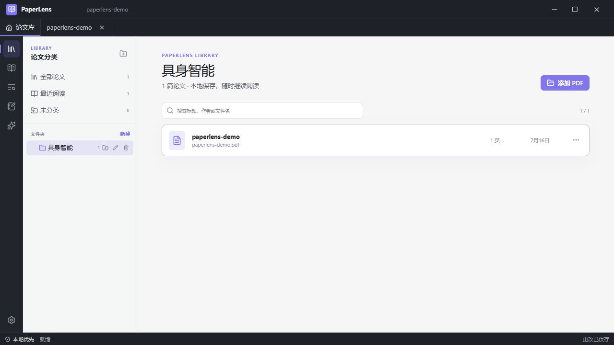
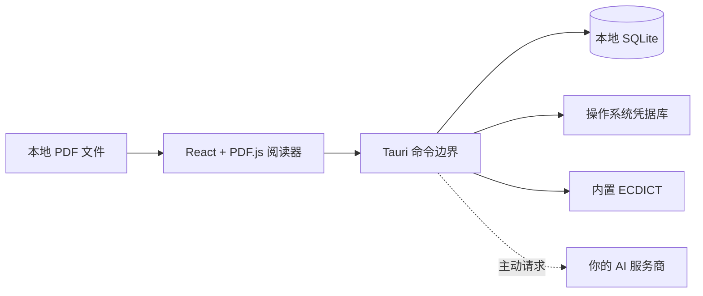

<div align="center">
  

  <h1>PaperLens</h1>

  <p><strong>读懂论文，也守住自己的研究数据。</strong></p>
  <p>一款快速、离线优先的桌面 PDF 阅读器，集成内置词典、关联笔记、论文分类与语境化 AI 解释。</p>

  <p>
    <strong>简体中文</strong>
    ·
    <a href="README.md">English</a>
  </p>

  <p>
    <a href="https://github.com/Yan-Haiyang-Tju/PaperLens/releases/latest"></a>
    <a href="https://github.com/Yan-Haiyang-Tju/PaperLens/releases/latest"></a>
    <a href="https://github.com/Yan-Haiyang-Tju/PaperLens/releases/latest"></a>
  </p>

  <p><sub>最新版本：v0.2.0 · 免费开源 · 使用你自己的 AI 服务与 API Key</sub></p>

  [](https://github.com/Yan-Haiyang-Tju/PaperLens/actions/workflows/ci.yml)
  [](https://github.com/Yan-Haiyang-Tju/PaperLens/releases/latest)
  [](https://github.com/Yan-Haiyang-Tju/PaperLens/releases)
  [](LICENSE)
</div>


PaperLens 把一篇论文周围的工作收进一个专注的桌面空间：打开本地 PDF、浏览目录、查询术语、高亮证据、记录想法，必要时请求语境化解释。整个过程中无需离开当前页面，也无需把论文库交给在线阅读服务。

## 三步开始阅读

1. 点击上方按钮，从 Releases 页面下载并安装适合当前系统的版本。
2. 打开 PDF，或把文件直接拖进窗口；按照课题、方向或阅读计划创建文件夹。
3. 选中任意文字，即可即时释义、高亮、添加笔记、收藏词汇，或请求 AI 结合上下文解释。

内置英汉词典首次启动即可离线使用。AI 完全可选，并使用你在服务商处申请的 API Key。

## 覆盖完整的论文阅读流程

| | PaperLens 能为你做什么 |
| --- | --- |
| **流畅阅读 PDF** | 支持文本选择、缩略图、快速目录、全文搜索、适应页面、旋转、键盘缩放，以及 `Ctrl/⌘ + 鼠标滚轮` 缩放；再次打开时自动恢复页码和缩放比例。 |
| **离线即时释义** | 内置基于 ECDICT 的英汉词典，无需配置、无需网络；还可导入自己的词典，或按需连接远程词典。 |
| **让笔记保留出处** | 高亮、Markdown 笔记、生词和 AI 解释始终关联原文与页码，不再散落成脱离论文的孤立文本。 |
| **结合语境请求 AI** | 把选中文字及其句子、段落、页码和章节一同交给 AI；支持流式显示、取消、重试，并可把结果保存为笔记。 |
| **按自己的方式整理** | 支持嵌套文件夹，同一篇论文可加入多个分类；“全部论文”“最近阅读”“未分类”让不断增长的论文库仍然清晰。 |
| **默认保留在本机** | PDF 与阅读数据留在本地。只有当你主动调用已配置的 AI 或远程词典时，应用才会访问对应网络服务。 |

PaperLens 提供 Graphite、Paper Light、Sepia、Midnight 和跟随系统五套主题，紧凑的桌面界面适合长时间阅读。

## 下载与安装

打开[最新版本页面](https://github.com/Yan-Haiyang-Tju/PaperLens/releases/latest)，选择对应平台的文件：

| 平台 | 选择文件 | 安装方式 |
| --- | --- | --- |
| **Windows 10/11** | `.msi` 或 `-setup.exe` | 运行安装程序，完成后从开始菜单打开 PaperLens。 |
| **macOS** | `.dmg` | 打开镜像，将 PaperLens 拖入“应用程序”；如同时提供多个包，请根据 Apple 芯片或 Intel 处理器选择。 |
| **Linux** | `.AppImage` 或 `.deb` | 为 AppImage 添加执行权限后运行，或使用系统包管理器安装 Debian 软件包。 |

当前发布包尚未进行代码签名。Windows SmartScreen 或 macOS Gatekeeper 因此可能显示“未知开发者”。请确认文件来自本仓库的 Releases 页面；信任该下载后，可使用系统提供的**更多信息 → 仍要运行**或**隐私与安全性 → 仍要打开**。

## 日常使用

### 阅读与导航

- 从论文库、文件选择器打开 PDF，也可以直接拖放。
- 使用缩略图或目录跳转页面，在整篇论文中搜索关键词。
- 通过工具栏、键盘或 `Ctrl/⌘ + 鼠标滚轮` 缩放，并可快速适应页面或宽度。
- 下次打开同一论文时，从上次的页码、比例和阅读位置继续。

### 立即查询术语

选中单词并点击**即时释义**。PaperLens 会依次查询内存与本地缓存、用户导入词典、内置离线词典，最后才是可选的远程数据源。无需下载词库，也无需注册账号。

内置数据基于 [ECDICT](https://github.com/skywind3000/ECDICT)，按照 MIT License 分发，每个应用安装包都包含完整归属声明。如需专业领域词汇，仍可在设置中导入有合法使用权的 JSON 词典。

### 高亮与笔记

选中一段原文后，可以选择高亮颜色或创建 Markdown 笔记。通过侧栏的**笔记**入口浏览当前论文的记录，选中笔记即可返回出处。你也可以创建不绑定选区的论文级普通笔记。

### 需要时再使用 AI

进入**设置 → AI 解释**，选择 OpenAI 或 OpenAI 兼容服务，填写服务实际支持的模型，并保存自己的 API Key。之后选中文字，点击**AI 解释**即可。

首次请求前，PaperLens 会展示即将离开本机的完整上下文。网络请求由原生 Rust 层发出；API Key 保存在 Windows 凭据管理器、macOS 钥匙串或 Linux Secret Service 中，也不会随论文库导出。

### 整理不断增长的论文库

用文件夹区分课题、研究方向、课程或阅读阶段。文件夹支持嵌套，同一篇论文可以加入多个文件夹而不复制原文件；删除文件夹也不会删除 PDF。



## 常用快捷键

| 操作 | 快捷键 | 操作 | 快捷键 |
| --- | --- | --- | --- |
| 打开 PDF | `Mod+O` | 论文内搜索 | `Mod+F` |
| 即时释义 | `Alt+D` | AI 解释 | `Alt+A` |
| 高亮 | `Alt+H` | 新建笔记 | `Alt+N` |
| 收藏词汇 | `Alt+S` | 显示/隐藏侧栏 | `Mod+Shift+B` |
| 缩放 | `Mod` + `+` / `-` / `0` | 关闭浮层或面板 | `Esc` |

Windows/Linux 上 `Mod` 表示 Ctrl，macOS 上表示 Command。快捷键可以在设置中调整，冲突会在干扰工作之前明确提示。

## 隐私从设计开始

- PaperLens 从 PDF 的原始本地路径读取文件，不会悄悄上传或创建多份副本。
- 阅读进度、文件夹、高亮、笔记、生词和缓存的解释保存在本地 SQLite 数据库中。
- 仅仅选中文字不会触发词典或 AI 网络请求。
- 第一次 AI 请求前会预览准确的发送内容，并剔除本地文件路径。
- API Key 由操作系统凭据服务保管，前端无法读取完整密钥。
- `.paperlens` 备份包含应用数据，但永远不会包含 API Key 或 PDF 文件。
- PaperLens 不包含统计、广告或行为追踪 SDK。

安全策略和私下报告漏洞的方式请参阅 [SECURITY.md](SECURITY.md)。

## 常见问题

<details>
<summary><strong>需要先导入词典吗？</strong></summary>

不需要。PaperLens 默认内置基于 ECDICT 的离线英汉词典。导入其他词典或配置远程地址只是可选的扩展方式。
</details>

<details>
<summary><strong>不用 AI 能正常使用吗？</strong></summary>

可以。PDF 阅读、搜索、文件夹、高亮、笔记、生词和离线释义均不依赖 AI。AI 只是使用个人 API Key 的增强功能。
</details>

<details>
<summary><strong>PaperLens 会上传我的论文吗？</strong></summary>

不会。PDF 始终留在原始路径。只有当你主动请求 AI 解释时，隐私预览中显示的上下文才会发送给所选服务商。
</details>

<details>
<summary><strong>为什么系统会显示安全警告？</strong></summary>

当前社区发布包尚未进行代码签名或公证。请只从本仓库 Releases 页面下载，并在允许未签名应用运行前检查版本说明。
</details>

<details>
<summary><strong>能阅读扫描版 PDF 吗？</strong></summary>

扫描页可以正常显示，但搜索和选择其中的文字需要 OCR，目前尚未内置。带文本层的 PDF 能获得完整体验。
</details>

## 从源码构建

需要 Node.js 22+、npm 10+、Rust stable，以及当前操作系统对应的 [Tauri 2 平台依赖](https://v2.tauri.app/start/prerequisites/)。

```bash
git clone https://github.com/Yan-Haiyang-Tju/PaperLens.git
cd PaperLens
npm ci
npm run tauri build
```

开发命令：

```bash
npm run dev          # 在浏览器中开发 React 界面
npm run tauri dev    # 运行原生桌面应用
npm run typecheck
npm run lint
npm test
npm run test:e2e
```

应用本身不依赖 Python 或 Conda；只有维护者重新生成内置词典资源时才需要使用 ECDICT 构建脚本。

## 技术架构



React 前端负责阅读交互与界面呈现；Rust 负责特权文件访问、内置词典、Provider 网络请求、安全凭据、导入导出校验、取消操作和结构化 AI 响应修复。Tauri capability 与严格的内容安全策略把这条边界控制在必要范围内。

## 测试与贡献

```bash
npm run typecheck
npm run lint
npm test
npm run build
npm run test:e2e
cargo fmt --manifest-path src-tauri/Cargo.toml --check
cargo clippy --manifest-path src-tauri/Cargo.toml --all-targets -- -D warnings
cargo test --manifest-path src-tauri/Cargo.toml --all-targets
```

欢迎提交缺陷报告、范围清晰的功能建议、文档改进和 Pull Request。参与前请阅读 [CONTRIBUTING.md](CONTRIBUTING.md)；涉及安全的问题请按照 [SECURITY.md](SECURITY.md) 私下报告，不要创建公开 Issue。

## 致谢

- [ECDICT](https://github.com/skywind3000/ECDICT)：内置离线词典的数据来源，按照 MIT License 使用。
- [PDF.js](https://github.com/mozilla/pdf.js)、[Tauri](https://tauri.app/) 以及所有让本地、可靠的桌面论文阅读器成为可能的开源项目。

## 许可证

PaperLens 使用 [MIT License](LICENSE) 发布。© 2026 PaperLens contributors.
