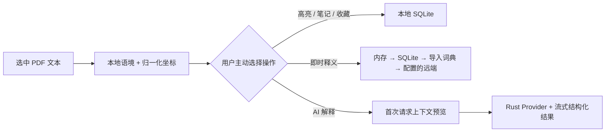
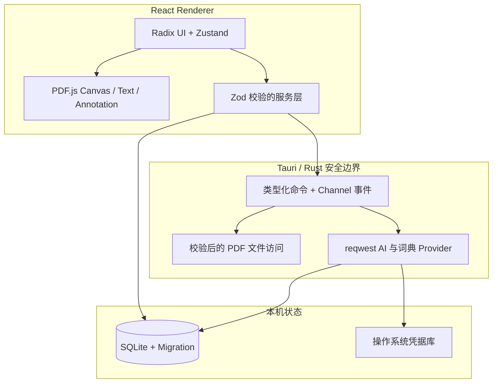

<div align="center">
  
  <h1>PaperLens</h1>
  <p><strong>一款安静、离线优先、支持语境解释的桌面论文阅读器。</strong></p>
  <p>专注精读，论文留在本机，只在你主动需要时请求帮助。</p>

  [](https://github.com/Yan-Haiyang-Tju/PaperLens/actions/workflows/ci.yml)
  [](https://v2.tauri.app/)
  [](https://react.dev/)
  [](LICENSE)

  [English](README.md) · **简体中文**
</div>


PaperLens 是面向科研论文精读的跨平台桌面工作台。它把完整的 PDF.js 阅读器、本地 SQLite 标注、可插拔词典与需要用户主动触发的结构化 AI 解释组合在 Tauri/Rust 原生安全边界之后。仅仅选中文字不会自动调用词典或 AI。

## 核心能力

| 阅读体验 | 知识工作流 | 原生与隐私 |
| --- | --- | --- |
| Canvas、可选择文本层、标注层彼此分离 | 结合句子/段落/章节的词典与结构化 AI 解释 | Tauri 2 命令、最小 capability 与严格 CSP |
| 缩略图、目录、全文搜索、缩放、适宽、旋转 | 高亮、Markdown 笔记、词汇与多处出现记录 | 带 migration 和外键的 SQLite 持久化 |
| 多标签论文库、拖放、最近阅读、位置恢复 | 首次请求展示精确上下文，支持流式、停止、重试、修复 | API Key 始终保存在操作系统凭据库 |
| 邻近页面渲染与 DPR 上限 | Markdown、GFM、KaTeX、置信度和模型详情 | 数据导入/导出/备份；导出不含密钥和 PDF |

Graphite、Paper Light、Sepia、Midnight、System 五套主题共用紧凑的桌面交互系统。阅读器按需加载，因此论文库和设置页不会在首屏加载整套 PDF.js。

## 划词是明确的操作边界

选中文字只会打开本地操作栏。PaperLens 在本机提取当前句、前后句、段落、页码、章节、提取置信度和归一化页面坐标。只有点击具体服务按钮后，才可能产生外部请求。



## 隐私与安全

- PDF 始终从原始本地路径读取；不会自动复制进数据库，也不会自动上传。
- OpenAI 与 OpenAI-compatible 请求只从 Rust 发出。Renderer 可以提交或删除密钥，但不存在读取完整密钥的命令。
- 密钥通过 Rust `keyring` 后端进入 Windows Credential Manager、macOS Keychain 或 Linux Secret Service。
- 第一次 AI 请求前会展示即将发送的精确上下文；本地文件路径会被剔除，过长字段按单词边界截断。
- 默认不保存完整 AI 请求上下文；日志只保存上下文哈希、Token 用量和脱敏后的错误类别。
- `.paperlens` 导出包只包含数据库快照和 manifest，不包含 API Key 与 PDF 文件。
- 未配置远程词典地址时不会访问词典网络；地址必须是 HTTPS（开发用 localhost 可使用 HTTP）。

## 架构



Renderer 负责呈现与 PDF 交互；Rust 负责特权文件访问、Provider 网络请求、安全凭据、导入导出校验、取消和 AI 响应修复。每个流式事件都携带 `paperId`、`selectionId` 与 `requestId`，store 会拒绝来自旧论文或旧选择的过期事件。

## 安装

打标签后，Release 工作流会为 Windows、macOS 和 Linux 生成安装包，入口见 [GitHub Releases](https://github.com/Yan-Haiyang-Tju/PaperLens/releases)。在项目尚未配置代码签名/公证身份时，本地无签名构建可能触发操作系统的常规安全提示。

### 从源码构建

需要：

- Node.js 22+ 与 npm 10+
- Rust stable
- Tauri 2 平台依赖：Windows WebView2、Linux WebKitGTK 4.1，或 macOS Xcode Command Line Tools

```bash
git clone https://github.com/Yan-Haiyang-Tju/PaperLens.git
cd PaperLens
npm ci
npm run tauri build
```

常用开发命令：

```bash
npm run dev          # 浏览器友好的 UI 开发
npm run tauri dev    # 原生桌面开发
npm run typecheck
npm run lint
npm test
npm run test:e2e     # 先构建生产资源，再运行浏览器冒烟测试
```

PaperLens 不依赖 Python 或 Conda。如果需要自定义编译器，请保持项目内隔离；`.tools/`、`.conda/`、构建产物、缓存、数据库与 `.env` 都已忽略，不会污染基础环境或进入 Git。

## 配置 AI Provider

打开 **设置 → AI 解释**，可选择：

- **OpenAI Responses API**：严格 JSON Schema 输出与原生流式响应。
- **OpenAI 兼容接口**：可配置 HTTPS Base URL，兼容 chat-completions 风格的结构化 JSON。
- **Mock**：只在开发构建中出现，不访问网络，输出可重复结果。

填写 Provider 实际支持的模型名称，安全保存 API Key，然后点击 **测试连接**。AI 面板支持流式状态、停止、修复提示、重试、复制、保存笔记、收藏词汇、查看上下文、Token 用量、缓存状态与置信度。

## 导入本地词典

PaperLens 不捆绑来源或许可证不明的词库。可以导入如下 UTF-8 JSON 数组：

```json
[
  {
    "term": "compliance",
    "phonetic": "/kəmˈplaɪəns/",
    "meanings": [
      { "partOfSpeech": "noun", "definitionsZh": ["合规；遵从"] }
    ],
    "lemma": "compliance",
    "source": "my-licensed-dictionary",
    "cachedAt": null
  }
]
```

请只导入你有权使用的数据。查询顺序固定为：内存缓存 → SQLite 缓存 → 已导入词典 → 已配置远程 Provider。

## 默认快捷键

| 操作 | 快捷键 | 操作 | 快捷键 |
| --- | --- | --- | --- |
| 打开 PDF | `Mod+O` | 论文内搜索 | `Mod+F` |
| 即时释义 | `Alt+D` | AI 解释 | `Alt+A` |
| 高亮 | `Alt+H` | 笔记 | `Alt+N` |
| 收藏词汇 | `Alt+S` | 显示/隐藏侧栏 | `Mod+Shift+B` |
| 缩放 | `Mod` + `+` / `-` / `0` | 关闭临时面板 | `Esc` |

Windows/Linux 上 `Mod` 表示 Ctrl，macOS 上表示 Command。快捷键可以编辑，重复配置会标红；光标位于输入框时不会误触。

## 验证

仓库包含工具函数、组件、状态竞态、数据库、Rust Provider 和真实浏览器 E2E 测试。E2E 会在运行时生成合法的文本层 PDF，验证渲染、页码、原生鼠标划词、操作栏和高亮叠加；开发期间另使用一篇真实的 15 页研究论文验证 PDF.js 解析与搜索文本提取。

```bash
npm run lint
npm test
npm run build
npm run test:e2e
cargo fmt --manifest-path src-tauri/Cargo.toml --check
cargo clippy --manifest-path src-tauri/Cargo.toml --all-targets -- -D warnings
cargo test --manifest-path src-tauri/Cargo.toml --all-targets
```

## 当前范围

- 完整支持带文本层的 PDF。扫描图片型 PDF 会给出明确提示；OCR 仍在规划中，程序不会悄悄生成不可靠的划词结果。
- 远程词典需要用户配置 endpoint，本地词典需要显式导入有授权的数据文件。
- Release 签名/公证证书属于仓库所有者的发布基础设施，不会嵌入源码。

## 目录结构

```text
src/                    React UI、PDF 分层、Store、Service 与测试
src-tauri/              Rust 命令、Provider、SQLite migration、Capability
prompts/                版本化 AI Prompt 与严格解释 Schema
tests/e2e/              生产浏览器阅读链路
docs/images/            可复现的项目截图
.github/workflows/      CI 与跨平台 Draft Release
```

提交 PR 前请阅读 [CONTRIBUTING.md](CONTRIBUTING.md)。安全问题请通过 GitHub Security Advisory 私下报告，见 [SECURITY.md](SECURITY.md)。

## 许可证

[MIT](LICENSE) © 2026 PaperLens contributors.
