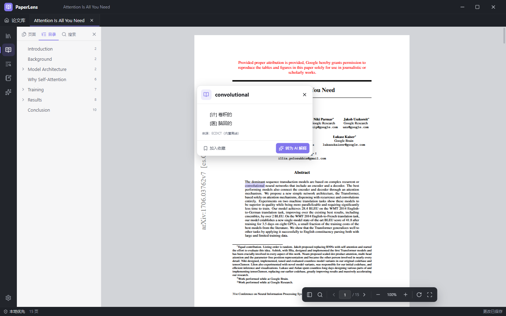
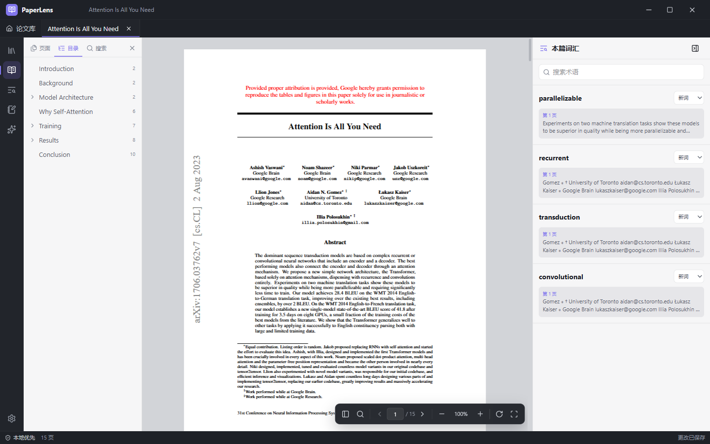
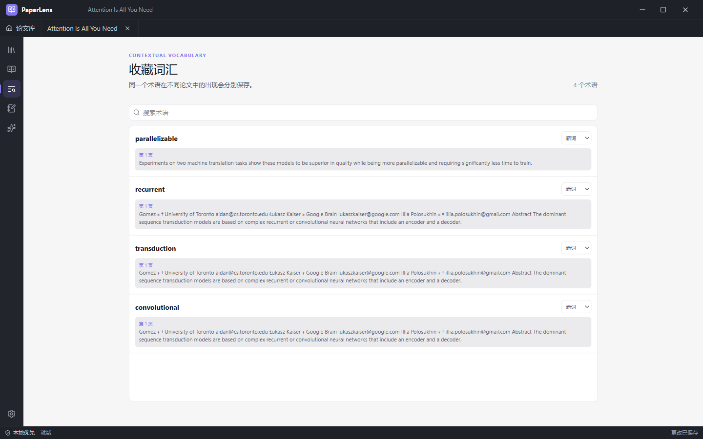
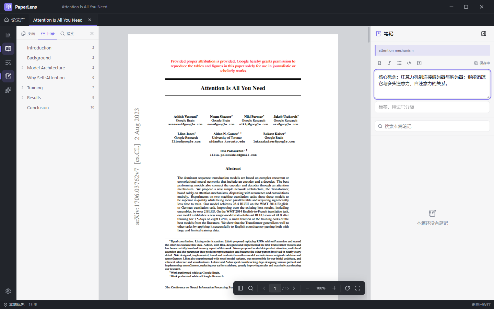
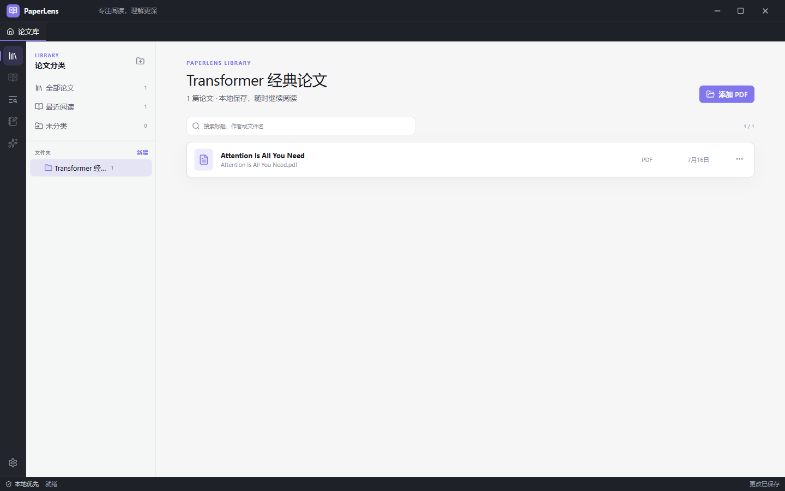
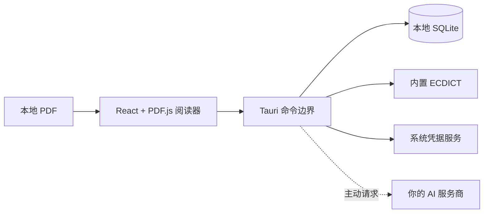

<p align="center">
  
</p>

<h1 align="center">PaperLens</h1>

<p align="center">
  <strong>读过一篇论文，留下它的专业词汇。</strong><br />
  一款把划词释义、原文语境与长期词汇积累连成一条线的本地优先桌面论文阅读器。
</p>

<p align="center">
  <strong>简体中文</strong>
  ·
  <a href="README.md"><strong>English</strong></a>
</p>

<p align="center">
  <a href="https://github.com/Yan-Haiyang-Tju/PaperLens/releases/latest"></a>
  <a href="https://github.com/Yan-Haiyang-Tju/PaperLens/releases/latest"></a>
  <a href="https://github.com/Yan-Haiyang-Tju/PaperLens/releases/latest"></a>
</p>

<p align="center">
  <a href="https://github.com/Yan-Haiyang-Tju/PaperLens/actions/workflows/ci.yml"></a>
  <a href="https://github.com/Yan-Haiyang-Tju/PaperLens/releases/latest"></a>
  <a href="https://github.com/Yan-Haiyang-Tju/PaperLens/releases"></a>
  <a href="LICENSE"></a>
</p>


> 普通 PDF 阅读器帮你翻完一篇论文；**PaperLens 帮你记住这个领域的语言。**

## 论文里的专业词汇，值得被留下

把释义复制到另一个笔记软件，会丢掉当时真正有用的原句；切到浏览器搜索，会不断打断阅读；只有单词和中文的扁平词表，则很快忘记它来自哪篇论文、为什么重要。

PaperLens 把专业词汇记录变成阅读动作的一部分：

1. 在 PDF 中**划中术语**。
2. 立即获得**离线英汉释义**，无需配置、联网或注册。
3. **一键收藏**，同时保留论文、页码、所选文字和上下文原句。
4. 在单篇论文或整个论文库中**长期复习**，并把熟悉度从“新词”逐步调整为“已掌握”。

<table>
  <tr>
    <td width="50%" valign="top">
      
      <br /><sub><strong>不离开当前页面就能查。</strong>内置 40 万+ 词条的 ECDICT 英汉词典，安装后第一次启动即可离线使用。</sub>
    </td>
    <td width="50%" valign="top">
      
      <br /><sub><strong>把“为什么要记它”一起留下。</strong>每个术语都与原始句子和页码保持关联。</sub>
    </td>
  </tr>
</table>

## 从真实研究中长出来的专业词汇库

它不是一套泛化的背单词卡片，也不是一堆失去出处的复制文本。PaperLens 按照你真正读过的论文建立术语索引——下图中的 `convolutional`、`transduction`、`recurrent` 和 `parallelizable`，全部直接收藏自同一篇论文的摘要。



- 在整个论文库中搜索专业词汇，也可以只查看当前论文。
- 同一个术语在不同论文中的出现记录分别保留。
- 从词汇出现记录直接返回原始页码。
- 使用**新词、学习中、熟悉、已掌握**四级熟悉度管理。
- 当研究方向超出通用词典时，可继续导入有合法授权的专业词典。

## 一条不中断的论文阅读链路

| | PaperLens 的优势 |
| --- | --- |
| **认真阅读 PDF** | 可选中文本、缩略图、渐进式目录、全文搜索、旋转、适合页面/宽度，以及流畅的 `Ctrl/⌘ + 鼠标滚轮` 缩放；自动恢复页码与阅读位置。 |
| **上下文专业词汇** | 离线释义、一键收藏、原句、页码、全局检索和熟悉度管理全部位于同一条阅读流程。 |
| **有出处的笔记** | Markdown 笔记始终关联选中原文和页码；不需要划词时，也可以记录论文级自由笔记。 |
| **由你决定是否使用 AI** | 只有主动点击后，才会把选中文字和局部上下文发送给你配置的兼容服务商；API Key 也由你自己提供。 |
| **可以生长的论文库** | 嵌套文件夹、多文件夹归属、拖放整理、“最近阅读”和“未分类”视图，不复制原始 PDF。 |
| **默认留在本机** | PDF、阅读进度、分类、词汇、高亮、笔记和缓存结果都保存在本地；不包含统计或广告 SDK。 |

<table>
  <tr>
    <td width="50%" valign="top">
      
      <br /><sub><strong>在证据旁边记录想法。</strong>笔记保留选中短语与原始页码。</sub>
    </td>
    <td width="50%" valign="top">
      
      <br /><sub><strong>分类而不复制文件。</strong>同一篇本地论文可以归入多个嵌套分类。</sub>
    </td>
  </tr>
</table>

<p align="center"><sub>产品截图使用 Vaswani 等人于 2017 年发表的 <a href="https://arxiv.org/abs/1706.03762"><em>Attention Is All You Need</em></a>（arXiv:1706.03762）。该论文及作者与 PaperLens 不存在隶属或背书关系。</sub></p>

## 下载后即可开始阅读

打开[最新版本页面](https://github.com/Yan-Haiyang-Tju/PaperLens/releases/latest)，选择你的操作系统并打开一个本地 PDF。内置词典无需配置；AI 完全可选。

| 平台 | 下载文件 | 使用方式 |
| --- | --- | --- |
| **Windows 10/11 x64** | `.msi` 或 `-setup.exe` | 运行安装程序，然后从开始菜单打开 PaperLens。 |
| **macOS Apple 芯片** | `aarch64.dmg` | 打开镜像，将 PaperLens 拖入“应用程序”。 |
| **Linux x86_64** | `.AppImage`、`.deb` 或 `.rpm` | 直接运行 AppImage，或安装对应发行版软件包。 |

当前社区安装包尚未进行代码签名或公证，因此 Windows SmartScreen 或 macOS Gatekeeper 可能显示“未知开发者”。请只从本仓库 Releases 页面下载，并在允许未签名应用运行前检查版本信息。

想复现上方的完整流程？从 arXiv 下载 [Attention Is All You Need](https://arxiv.org/pdf/1706.03762)，在 PaperLens 中打开，然后划中摘要里的 `convolutional`。

## 隐私不是口号，而是产品能力

- PaperLens 从 PDF 当前所在的本地路径读取文件，不会静默复制或上传。
- 仅仅选中文字不会自动发起 AI 请求或远程词典查询。
- 内置词典完全离线；只有主动配置后才会启用远程词典。
- 第一次 AI 请求前会展示准确的发送内容，并移除本地文件路径。
- API Key 保存在 Windows 凭据管理器、macOS 钥匙串或 Linux Secret Service 中。
- `.paperlens` 备份包含应用数据，但永远不包含 API Key 或 PDF 文件。

安全模型和私下报告漏洞的方式请参阅 [SECURITY.md](SECURITY.md)。

## 不打断阅读的快捷键

| 操作 | 快捷键 | 操作 | 快捷键 |
| --- | --- | --- | --- |
| 打开 PDF | `Mod+O` | 论文内搜索 | `Mod+F` |
| 即时释义 | `Alt+D` | 收藏词汇 | `Alt+S` |
| 高亮 | `Alt+H` | 新建笔记 | `Alt+N` |
| AI 解释 | `Alt+A` | 显示/隐藏侧栏 | `Mod+Shift+B` |
| 缩放 | `Mod` + `+` / `-` / `0` | 关闭面板或浮层 | `Esc` |

Windows/Linux 上 `Mod` 表示 Ctrl，macOS 上表示 Command。快捷键可以自定义，发生冲突时会明确提示。

## 常见问题

<details>
<summary><strong>需要先导入词典吗？</strong></summary>

不需要。PaperLens 自带 40 万+ 词条的 ECDICT 英汉词典。导入专业词典或配置远程数据源只是可选扩展。
</details>

<details>
<summary><strong>必须使用 AI 吗？</strong></summary>

不需要。PDF 阅读、搜索、文件夹、高亮、笔记、词汇收藏和离线释义均不依赖 AI。AI 只是使用个人 API Key 的可选增强能力。
</details>

<details>
<summary><strong>PaperLens 会上传论文吗？</strong></summary>

不会。PDF 始终留在原始本地路径。只有当你主动请求 AI 解释时，隐私预览中显示的上下文才会发送给所选服务商。
</details>

<details>
<summary><strong>可以阅读扫描版 PDF 吗？</strong></summary>

扫描页面可以显示，但其中的搜索和划词需要 OCR；当前版本尚未内置 OCR。带文本层的 PDF 可以获得完整体验。
</details>

## 从源码构建

<details>
<summary><strong>开发环境、技术架构与验证命令</strong></summary>

需要 Node.js 22+、npm 10+、Rust stable，以及对应系统的 [Tauri 2 平台依赖](https://v2.tauri.app/start/prerequisites/)。

```bash
git clone https://github.com/Yan-Haiyang-Tju/PaperLens.git
cd PaperLens
npm ci
npm run tauri build
```

常用开发命令：

```bash
npm run dev
npm run tauri dev
npm run typecheck
npm run lint
npm test
npm run test:e2e
```

应用运行不依赖 Python 或 Conda。只有维护者重新生成已提交的 ECDICT 资源时才需要 Python。



前端负责阅读交互；Rust 负责特权文件访问、内置词典查询、Provider 网络请求、凭据、导入导出校验、取消操作和结构化 AI 响应修复。严格的 Tauri capability 与 CSP 将边界控制在必要范围内。

</details>

## 参与贡献

欢迎提交范围清晰的缺陷报告、功能建议、文档改进和 Pull Request。参与前请阅读 [CONTRIBUTING.md](CONTRIBUTING.md)；安全问题请按照 [SECURITY.md](SECURITY.md) 私下报告。

## 致谢

- [ECDICT](https://github.com/skywind3000/ECDICT)：内置离线词典的数据来源，按照 MIT License 使用。
- [PDF.js](https://github.com/mozilla/pdf.js)、[Tauri](https://tauri.app/)、React 与更广泛的开源生态。

## 许可证

PaperLens 使用 [MIT License](LICENSE) 发布。© 2026 PaperLens contributors.
